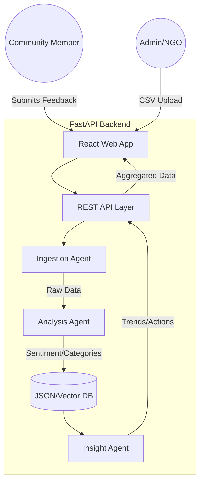
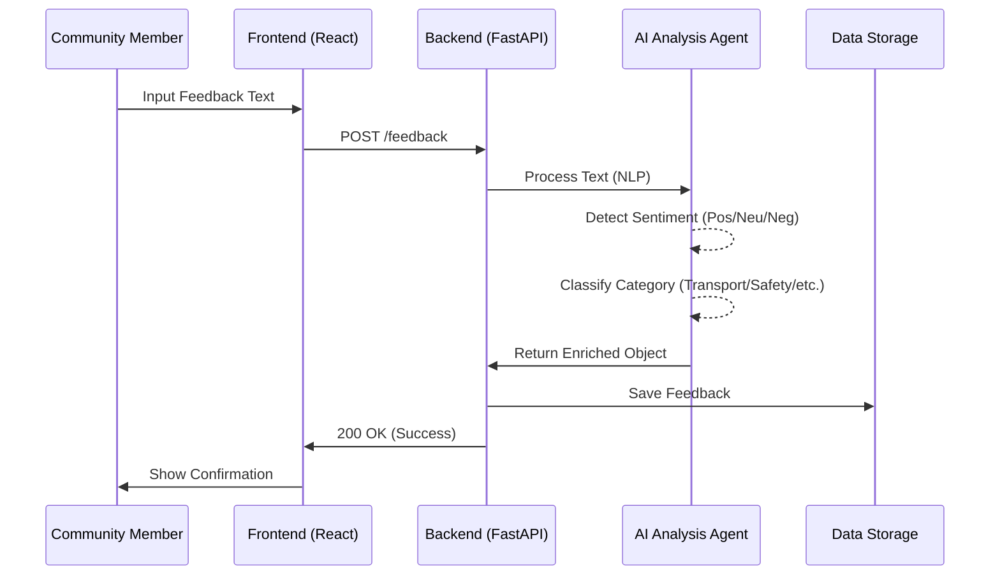

# CivicPulse AI – Autonomous Community Feedback Analyzer

CivicPulse AI is an AI-powered community insight platform that turns local voices into actionable decisions. It bridges the gap between community members and local leaders by collecting unstructured feedback (text/audio) and transforming it into structured, actionable insights.

## 🚀 Vision
In 2026, social good combined with autonomous AI agents creates a powerful narrative impact. CivicPulse AI empowers NGOs, student councils, and local organizers to act on real-time community sentiment without getting lost in manual data analysis.

---

## 🏗️ System Architecture

CivicPulse AI follows a multi-agent architectural pattern where specialized agents handle different stages of the data pipeline.

---

## 🔄 Data Pipeline Flow

The following flowchart illustrates how a single piece of feedback moves through the system:

---

## 🎨 UI Design System

CivicPulse AI features a **mobile-first, accessibility-centered design** optimized for professional community management.

### Design Principles:
- **Simple & Beginner-Friendly**: Clean hierarchy with large touch-friendly elements.
- **Glassmorphism**: Subtle translucency and blur effects for a premium feel.
- **Pro Color Palette**:
    - **Deep Blue** (#1E3A8A): Trust and authority.
    - **Soft Teal** (#0D9488): Community and growth.
    - **Warm Orange** (#F59E0B): Attention and action.

### Core Screens:

1. **Community Pulse Overview (Dashboard)**:
    - Quick-glance summary cards for total engagement and overall sentiment.
    - Real-time "Top Community Issues" ranked by frequency with visual progress bars.

2. **Feedback Submission**:
    - Distraction-free multi-line input.
    - Intelligent category selection for structured data collection.
    - Animated success states after submission.

3. **Feedback Analysis Agent**:
    - Scrollable list of cards with AI-generated sentiment badges.
    - Color-coded indicators (Green for Positive, Red for Negative).
    - Advanced filtering by sentiment type.

4. **Strategic Insights**:
    - AI-generated executive summary.
    - Bulleted "Key Themes" extracted from community discourse.
    - "Suggested Actions": Numbered, practical steps for local leaders.

---

## 🖼️ UI Screenshots

> [!NOTE]  
> The following are descriptive placeholders for the implemented UI. 

### 1. Community Pulse Overview (Dashboard)

*The main dashboard featuring summary cards and the ranked "Top Community Issues" list.*

### 2. Share Your Feedback

*The mobile-first feedback submission form with category selection and success states.*

### 3. Feedback Analysis

*The administrative view showing all feedback items with AI-assigned sentiment badges and category tags.*

### 4. Strategic Insights

*The AI-generated insights screen with executive summaries and suggested actions.*

---

## 🛠️ Tech Stack

- **Frontend**: React.js, Vite, Lucide React (Icons), Vanilla CSS (Custom Design System).
- **Backend**: Python, FastAPI, Uvicorn.
- **AI/NLP**: Custom agents for sentiment detection and theme clustering.
- **Persistence**: Local data management (JSON/CSV) for field reliability.

---

## 🏁 Installation & Setup

### Prerequisites:
- Python 3.9+
- Node.js 18+

### Backend Setup:
1. Navigate to `/backend`
2. Run `python -m venv venv`
3. Activate: `.\venv\Scripts\activate` (Windows)
4. Install: `pip install -r requirements.txt`
5. Start: `python main.py`

### Frontend Setup:
1. Navigate to `/frontend`
2. Install: `npm install`
3. Start: `npm run dev`

---

## ⚖️ Disclaimer
*AI-generated insights are advisory and for community planning purposes only. CivicPulse AI does not provide medical or legal advice.*
